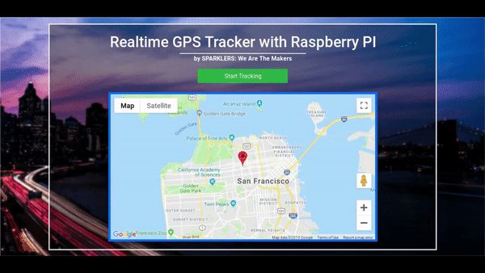

# Live-GPS-Tracker-using-Raspberry-Pi-and-Neo-6m-GPS-module-with-Firebase
Here I have made a realtime GPS tracker device, which you can track from anywhere in the world, using Raspberry Pi, Python, Javascript and Firebase. At the end the client-side will look something like this:

 
To know how to use NEO 6M GPS module with Raspberry Pi and Python, you can read the article here : https://sparklers-the-makers.github.io/blog/robotics/use-neo-6m-module-with-raspberry-pi/ 
You can also watch these video tutorials for the same: 

## Authors

**Arijit Das** 
